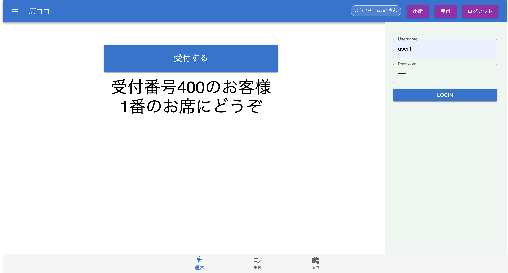
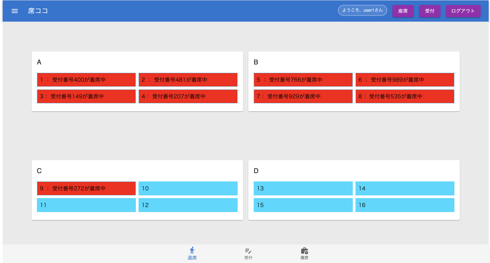

# Sekikoko(席ココ)

座席の空き状況と配席を管理するアプリです

# DEMO

<p >
  
  
  
</p>
 
# Features
 
食堂の座席が１つ飛ばしで空いていて効率的に席が使われていない場合や、
事前に予約や空き状況を確認するときに便利です。
 
# Requirement
 
 
* bcrypt
* cookie-parser
* cors
* dotenv
* express
* express-session
* knex
* passport
* passport-local
* pg
 
# Installation
 
 ```
 npm install
 ```
 
# Usage
 
まず初めにログインをしてください、ログインしない場合は空席状況の確認のみできます。
1.ログイン後に受付するボタンを押して案内させた席に着席
2.退席時は下の退席ボタン

 
# Note
 
満席時は案内された番号が呼ばれるまでお待ちください
 
# Author
 
 
* しゃかぽて
* JR東日本
* kobayashi-keita@jreast.co.jp
 
# License

誰でも無許可で使ってください